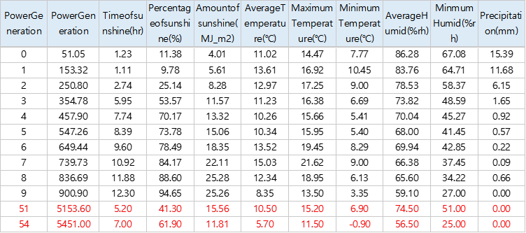
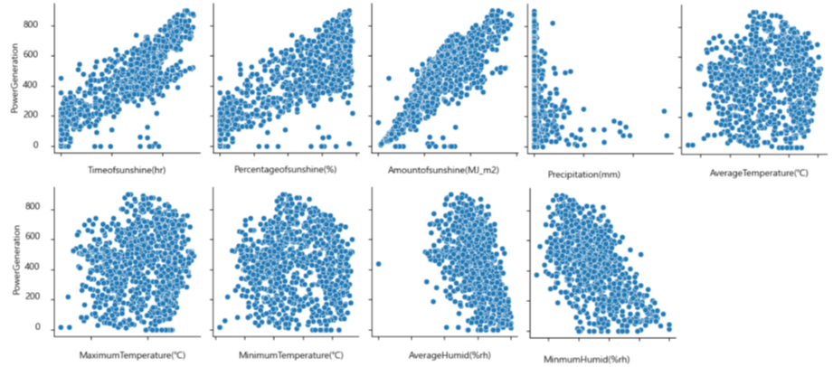
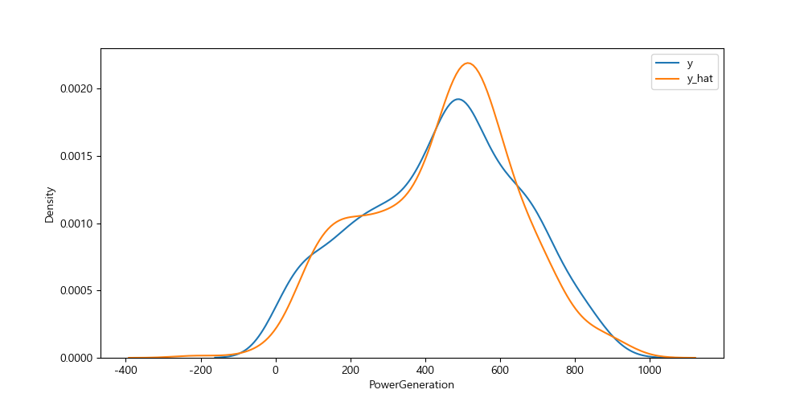

# DataAnalysis
Data Analysis for power generation by clamatic conditions.

## Manual
`$ python main.py`

## Develop Environment
`python` >= 3.9.13   
`require` == [link](requirements.txt)   

## Data Collection
* [Climate Information](https://data.kma.go.kr/cmmn/maindo)
* [Generation of Solar Power](https://www.data.go.kr/)

## Data Analysis
<b>Table 1 Median of Generation Amount with Date</b>   
|year	|1	|2	|3	|4	|5	|6	|7	|8	|9	|10	|11	| 12|
| --    |-- | --| --| --| --| --| --| --| --| --| --| --|
|2019	|	|	|	|	|	|	|	|	|464.7|	512.4|	446.8|	408.4|
|2020	|436.6	|538	|665|	786.5|	584.4|	612|	414|	276|	530|	563.4|	463|	398.6|
2021|	320|	556.9|	618.8|	697|	600|	567.1|	459.6|	294.8|	357|	187.2|	411.6|	370.4|
2022|	479|	378|	372.8|									

According to this table, April and September are the months that generate most power. Interesting point is that power generation in spring and fall are more than summer. 

<b>Figure 1 bar graph with power generation </b>
   

<b>Figure 2 Correlation between solar power generation and climatic conditions</b>

The above figure is a heatmap graph showing the correlation between solar power generation and various climatic conditions. According to this graph, time of sunshine, amount of sunshine, and percentage of sunshine have more correlation than other conditions. And it suggests that in solar power generation, high temperature is not primary condition.

<b>Figure 3 scatter about primary conditions</b>   

The above scatter graph is about power generation with two primary conditions that hours of sunshine and amount of sunshine. It seems like that power generation in direct proportion to other two conditions.   

<b>Table 2 Average climatic conditions with power generation in 100 unit</b>

 
I found that high Percentage of sunshine, Amount of sunshine, and time of sunshine lead to increase amount of solar power generation. This insight can find in the table. However, the humidity makes the power generation decrease.
Looking at the statistics, we can know that last two samples at the bottom have some error. See about other data, their power generations are expected 500~600 kW. So, when we use these data, discard two wrong sample. Then we will get more precise result.

<b>Figure 4 scatter about power generation and other conditions except wrong samples</b>

 
## Machine Learning Model and calculation of evaluations
In data preprocessing, first translate columns Korean name into English. Next step is discarding wrong samples. And then chose independent variables. To expect power generation with other variables, x consists of below variables. The last step is that converting x to quadratic polynomial.

> <b>Table 3 Information of independent variables </b>   
> Data columns (total 9 columns):
> | # |	Column	|Count	|Non-Null	|Dtype|
> | -- | -- | -- | -- |-- |
> |0|	Timeofsunshine(hr)|	941	|non-null|	float64|
> |1|	Percentageofsunshine(%)|	941	|non-null|	float64|
>|2|	Amountofsunshine(MJ_m2)|	941|	non-null|	float64|
>|3|	AverageTemperature(℃)|	941|	non-null|	float64|
>|4|	MaximumTemperature(℃)|	941|non-null|	float64|
>|5|	MinimumTemperature(℃)|	941|	non-null|	float64|
>|6|	AverageHumid(%rh)|	941	|non-null|	float64|
>|7|	MinmumHumid(%rh)|	941|	non-null|	int64|
>|8|	Precipitation(mm)|	941	|non-null|	float64|
Use ‘sklearn’ to make prediction model. The train and test rate is 7:3. After linear regression fitting, here is scatter graphs between power generation and some conditions. Graphs about other variables can find github result directory.

<b>Figure 5 scatter graph with predict and train</b>   
%20Prediction.png)   
%20Prediction.png)
%20Prediction.png)

<b>Figure 6 Density about Power generation prediction and answer data</b>   

The above graph shows that density about power generation prediction and real data. Compare to two data, it shows that model fitted with train data has about 80% accuracy.   
> Accuracy:  0.7943065062180832 
